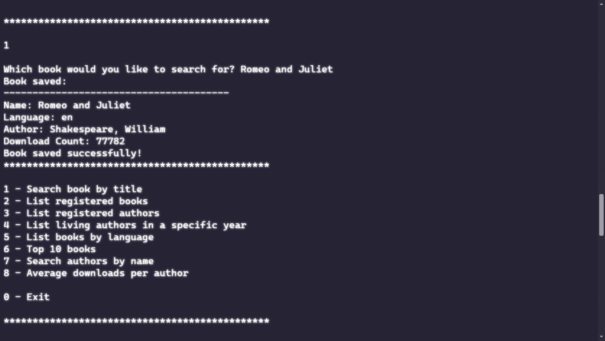
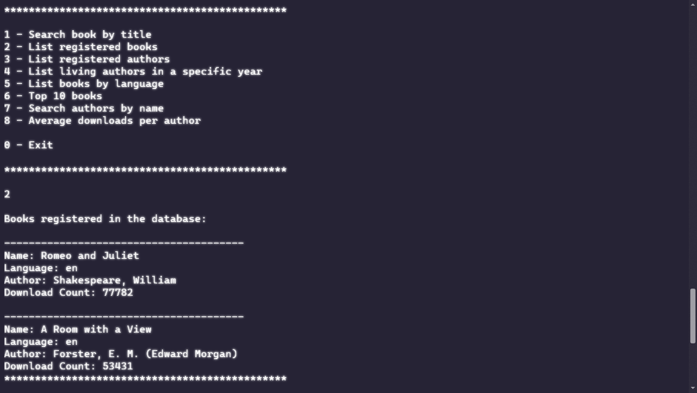
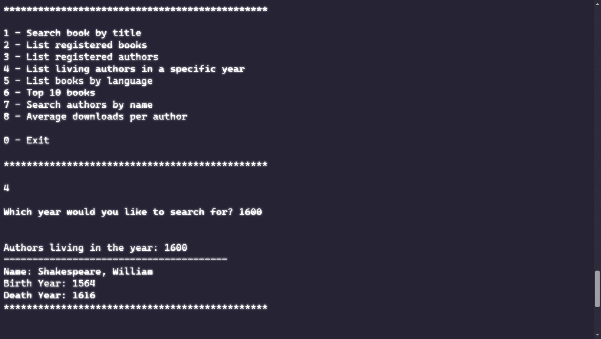

# Book Catalog

LiterAlura is a book catalog project developed as part of the ONE (Oracle Next Education) program. This project demonstrates how to use Java, Spring Boot, and PostgreSQL to interact with the Gutendex API, retrieve book and author data, and persist this data in a relational database.

## Description

LiterAlura allows users to search for books by title using the Gutendex API, view a list of all registered books, and view a list of all registered authors. Users can also see statistics about the number of books in a specific language and find authors who were alive in a given year.

## Features

- **Search Book by Title**: Retrieve book information from the Gutendex API by title.
- **List All Registered Books**: Display all books that have been registered in the database.
- **List All Registered Authors**: Display all authors associated with the registered books.
- **List Authors Alive in a Specific Year**: Find authors who were alive in a given year.
- **Display Number of Books by Language**: Show statistics on the number of books in specific languages.
- **Generate Download Statistics**: Use DoubleSummaryStatistics to provide statistical data on book downloads.
- **Top 10 Most Downloaded Books**: Display the top 10 most downloaded books.
- **Search Author by Name**: Retrieve author information from the database by name.
- **Additional Author Queries**: Perform various queries based on authors' birth and death years.

## Technologies

- **Java 17**: Programming language used for development.
- **Spring Boot 3.2.3**
- **Maven**: Automation tool for building and dependency management.
- **PostgreSQL**: Open-source relational database management system (RDBMS) that emphasizes extensibility and SQL compliance. It provides robust features for data storage, retrieval, and management.
- **Gutendex API**: Gutendex API provides Web-API for fetching data from Project Gutenberg Books Library. More information can be found at [Gutendex](https://gutendex.com/).
- **Jackson (for JSON parsing)**
- **HttpClient (for API requests)**

## Setup and Installation

1. **Clone the Repository:**

```sh
git clone https://github.com/jonnrib/challenge-one-catalog
```

2. **Change the Directory:**

```sh
cd /path/to/challenge-one-catalog
```

3. **Create a Database User and Database in PostgreSQL:**

   Open pgAdmin and follow these steps:

   - **Create a New Database:**

     - Right-click on `Databases` in the left navigation pane and select `Create > Database...`.
     - Enter `literAlura` as the database name and select the owner (user).

   - **Create a New User/Role:**

     - Right-click on `Login/Group Roles` and select `Create > Login/Group Role...`.
     - Enter `your_username` as the username.
     - Go to the `Definition` tab and enter the password.
     - Go to the `Privileges` tab and grant all necessary permissions (`Can login`, `Create DB`, etc.).

   - **Grant Permissions to the User:**

     - Right-click on the `literAlura` database, select `Properties`, and go to the `Privileges` tab.
     - Add the user (`your_username`) and grant the necessary permissions.

4. **Configure Environment Variables:**

   Set the following environment variables on your system:

##### On Windows:

Open Command Prompt and enter:

```sh
setx CATALOG_DB_HOST "localhost"
setx CATALOG_DB_PORT "5432"
setx CATALOG_DB_NAME "literAlura"
setx CATALOG_DB_USERNAME "your_username"
setx CATALOG_DB_PASSWORD "your_password"
```

##### On Linux/Mac:

Open a terminal and enter:

```sh
export CATALOG_DB_HOST="localhost"
export CATALOG_DB_PORT="5432"
export CATALOG_DB_NAME="literAlura"
export CATALOG_DB_USERNAME="your_username"
export CATALOG_DB_PASSWORD="your_password"
```

**Note:** On Linux/Mac, you might want to add these lines to your `.bashrc` or `.zshrc` file to make the environment variables persistent across terminal sessions.

### Running the Application with Maven

If you are using Maven, you can use the following command to run your Spring Boot application:

1. **Navigate to Your Project Directory:**

   Open a terminal or command prompt and navigate to the root directory of your Spring Boot project (the directory containing `pom.xml`).

```sh
cd path/to/challenge-one-catalog
```

2. **Run the Application Using Maven:**

   Use the following command to run your application:

```sh
mvn spring-boot:run
```

3. **Using the Application:**

   Run the application and interact with the command-line interface to perform various operations such as searching for books, listing books and authors, and generating statistics.

## Configuration Parameters

- **spring.application.name**: Defines the name of the application. In this case, it is set to `literAlura`.
- **spring.datasource.url**: URL for the PostgreSQL database connection, using environment variables to avoid exposing sensitive credentials.
- **spring.datasource.username**: Database username, defined as an environment variable.
- **spring.datasource.password**: Database password, defined as an environment variable.
- **spring.jpa.hibernate.ddl-auto**: Hibernate setting to automatically update the database schema.
- **spring.jpa.properties.hibernate.dialect**: Sets the Hibernate dialect for PostgreSQL.

## Screenshots

### Search Book by Title



### List All Registered Books



### List Authors Alive in a Specific Year



## Contribution

Feel free to fork this repository and contribute by submitting a pull request.

1. Fork the project.
2. Create a branch for your feature (`git checkout -b feature/AmazingFeature`).
3. Commit your changes (`git commit -m 'Add some AmazingFeature'`).
4. Push to the branch (`git push origin feature/AmazingFeature`).
5. Open a Pull Request.

## License

This project is licensed under the MIT License. See [LICENSE](/LICENSE) for more information.

## Contact

Jonnathan Ribeiro - jrib_st@outlook.com

Project Link: https://github.com/jonnrib/challenge-one-catalog
